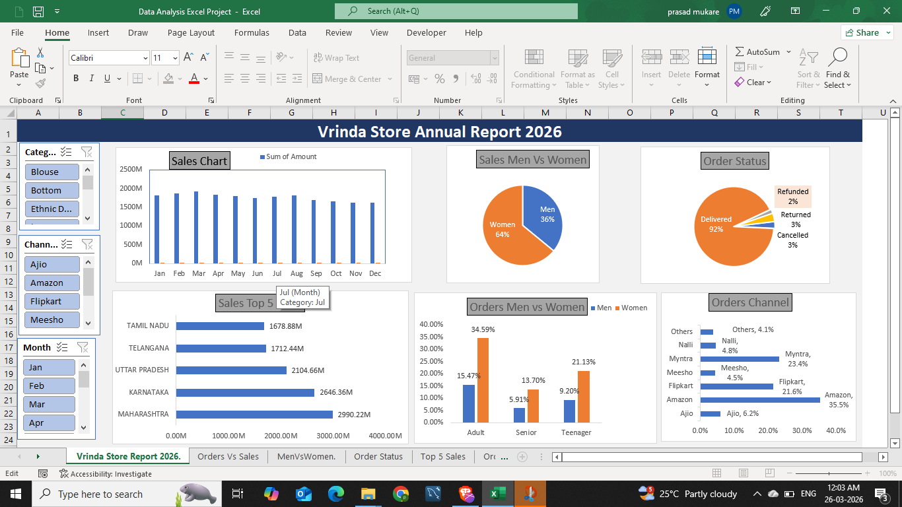

# Vrinda Store Annual Report 2026

## Overview
An interactive Excel dashboard analyzing Vrinda Store's 2026 sales data.

## Dashboard Preview

## Key Insights
- Women contribute 64% of total sales
- Amazon channel drives highest orders (35.5%)
- Maharashtra generates highest revenue (2990.22M)
- March shows peak sales trend

## Features
- Interactive slicers (Category, Channel, Month)
- Pivot Tables & Charts
- Sales trend analysis
- Gender & age-based order comparison

## Tools Used
- Microsoft Excel
- Pivot Tables
- Slicers
- Bar, Pie & Column Charts
